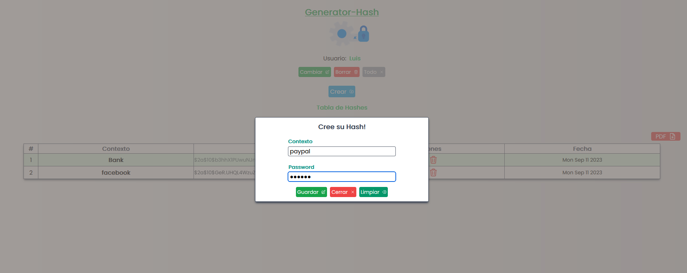
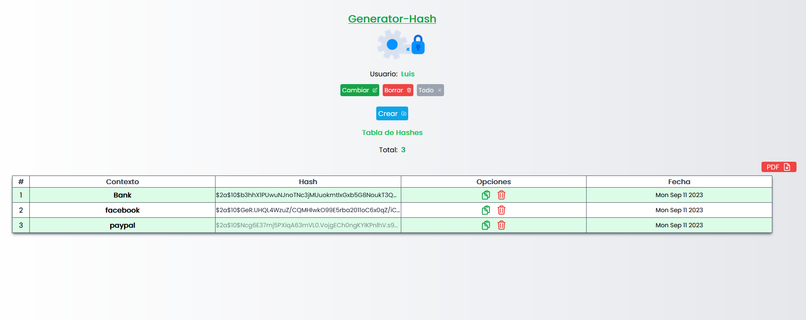
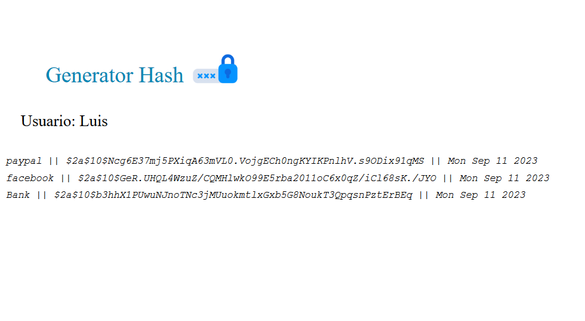

# Generator-Hash Application

#### A useful app that allow generate secure hashes and also make the correct managment store to your secrets passwords. Also you can generate a list of your hashes in a pdf file.


-------------------------------------------------------------------

# Requirments

+ Vue 3

+ Vite

+ Typescript

+ TailwindCss

----------------------------------------------------------------

# Installation

+ Installing all modules
```
npm install
```
+ Compiling the project
```
npm run build
```
+ Executing the project mode production
```
npm run preview
```
+ Put on your browser localhost:4173/


# Screebshots




### Adding a New Hash



###  Main View



### Pdf Generated

### Created by Userlg


